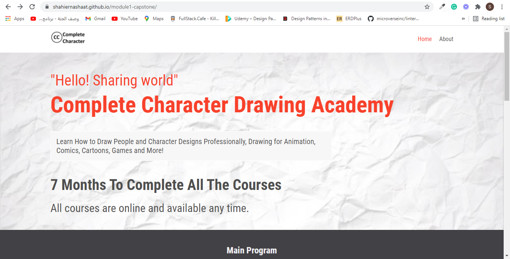

# Complete Character Drawing Academy

> Capstone project for HTML & CSS Module at Microverse.

The project is about academy that teach drawing, the website is cosisted of home and about pages and also responsive.

## Built With

- HTML
- CSS
- JavaScript

## Live Demo

[Live Demo Link](https://shahiernashaat.github.io/html-css-capstone/)

## Description Video

[See The Discription Video](https://www.loom.com/share/48f82f204ebb46559b2ade84a6827f3a)

## Getting Started

To get a local copy up and running follow these simple example steps.

- Click the green Code button on the repo.
- Copy the repository url
- In your local PC, open your terminal in the folder you would like to clone the project.
- type "git clone (repository url)"

## Authors

👤 **Shahier Nashaat**

- GitHub: [@githubhandle](https://github.com/ShahierNashaat)
- Twitter: [@twitterhandle](https://twitter.com/ShahierN)
- LinkedIn: [LinkedIn](https://www.linkedin.com/in/shahier-nashaat-73519313a/)

## 🤝 Contributing

Contributions, issues, and feature requests are welcome!

Feel free to check the [issues page](https://github.com/ShahierNashaat/module1-capstone/issues).

## Show your support

Give a ⭐️ if you like this project!

## Acknowledgments

- Got inspired by [Cindy Shin](https://www.behance.net/adagio07)

## 📝 License

This project is [MIT](./MIT.md) licensed.
